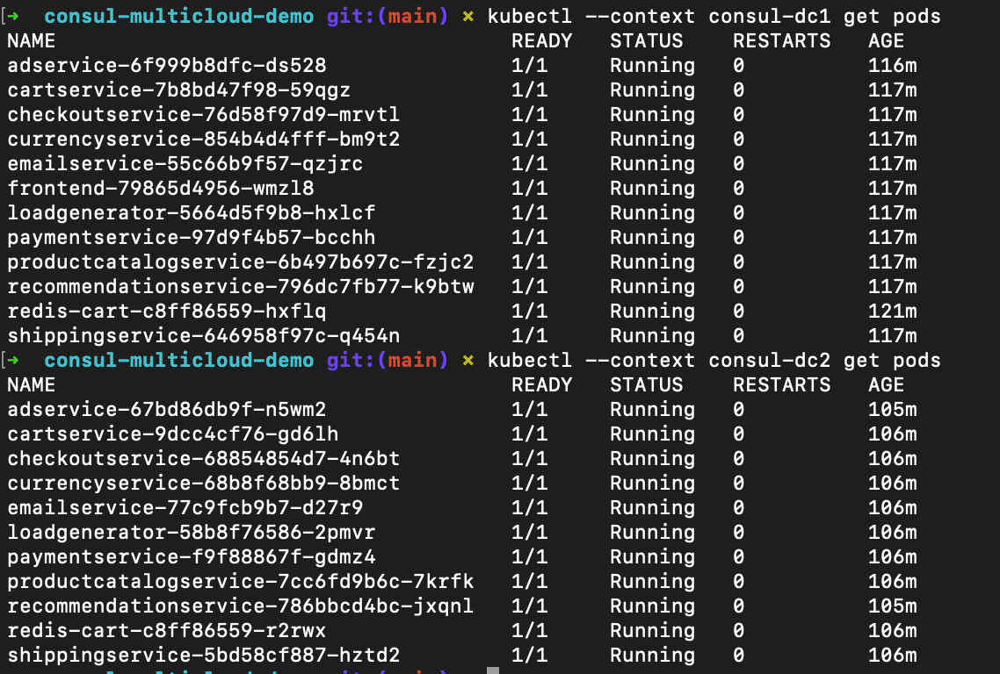
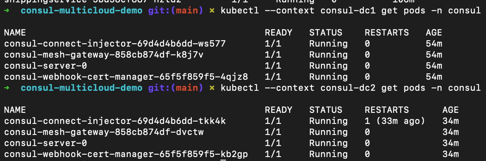
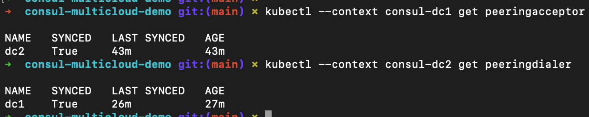
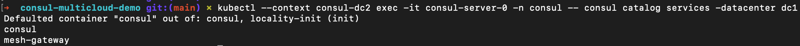

# consul-multicloud-demo

**Submission repo:** [https://github.com/vince6942O/consul-multicloud-demo](https://github.com/vince6942O/consul-multicloud-demo)  

This project uses **HashiCorp Consul** as a **Kubernetes service mesh** on **more than one cluster**, with **mesh gateways**, **cluster peering**, and **failover** so the stack can survive losing a side. The demo app is the **Online Boutique** e-commerce microservices from Google’s repo, deployed with **Google’s public container images** 

---

## What This Repo Contains

1. **From [GoogleCloudPlatform/microservices-demo](https://github.com/GoogleCloudPlatform/microservices-demo)**
  Kubernetes manifests under `microservices/kubernetes-manifests/` (per-service YAMLs, `kustomization.yaml`, and `kubernetes-manifests.yaml` with real image URLs). Enough to **build/deploy the e-commerce app** on K8s using the public GCP images.
2. **From [consul-crash-course](https://gitlab.com/twn-youtube/consul-crash-course) / [Ms. Nana’s video](https://www.youtube.com/watch?v=s3I1kKKfjtQ)
  Consul-related **scripts and manifests**: **Terraform for AWS VPC + EKS** (`consul/terraform/`) exactly as in the course repo (submission material—the video is AWS-based), plus Helm-style **values** (`consul/helm-values-dc1.yaml`, `consul/kubernetes/consul-values.yaml`, examples), **peering** (`peering-acceptor.yaml`, `peering-dialer.yaml`), **exported services**, **failover** (`consul/failover/service-resolver.yaml`), **mesh gateway** CRD, LB for Consul server gRPC (`consul-server-lb.yaml`), and extra samples under `consul/kubernetes/` (Mesh, intentions/resolver examples, app YAMLs wired for Connect, debug pod). Terraform commands are summarized in `consul/Readme.md`.
3. **What I did (my part)**
  I did **everything on Azure only**: brought up **two AKS** clusters (two resource groups and two separate clusters on two different region), wired `**kubectl`** with `**az aks get-credentials**`, installed **Consul with Helm** using the course-style values, created **peering tokens/secrets**, applied the **peering / export / failover / mesh** YAMLs, deployed the **boutique** manifests, and **tested** end-to-end. I **tuned** Azure-specific bits (**LoadBalancer** frontends, advertise addresses where the course showed AWS, datacenter names, which YAMLs per cluster). I took the **screenshots** and wrote this **README**.
4. **Evidence**
  Screenshots at the bottom back up that the system was actually running.

---

## Acknowledgments

- **Google Cloud Platform** — [microservices-demo](https://github.com/GoogleCloudPlatform/microservices-demo): application design and Kubernetes manifests.  
- **TechWorld with Nana** — [YouTube: Consul crash course](https://www.youtube.com/watch?v=s3I1kKKfjtQ) and [GitLab course repo](https://gitlab.com/twn-youtube/consul-crash-course): Consul on Kubernetes, peering, and mesh layout I used.

---

## Project Layout

| Path                                  | Role                                                                                                                                                                                   |
| ------------------------------------- | -------------------------------------------------------------------------------------------------------------------------------------------------------------------------------------- |
| `microservices/kubernetes-manifests/` | GCP Online Boutique manifests; use `kubernetes-manifests.yaml` for one-shot `kubectl apply` with public images.                                                                        |
| `consul/terraform/`                   | **From the course:** Terraform for **AWS VPC + EKS** (+ EBS CSI). **My deployment used AKS only**; use this folder only if you want to reproduce the original AWS path from the video. |
| `consul/*.yaml` (root)                | Peering, exports, Helm values sample, server LB.                                                                                                                                       |
| `consul/failover/`                    | Failover `ServiceResolver` example.                                                                                                                                                    |
| `consul/kubernetes/`                  | More Consul CRDs / course-style YAML and bundled app configs with GCP images.                                                                                                          |
| `screenshots/`                        | Submission screenshots.                                                                                                                                                                |

---

## References

- Course GitLab: [https://gitlab.com/twn-youtube/consul-crash-course](https://gitlab.com/twn-youtube/consul-crash-course)  
- Video: [https://www.youtube.com/watch?v=s3I1kKKfjtQ](https://www.youtube.com/watch?v=s3I1kKKfjtQ)  
- GCP demo: [https://github.com/GoogleCloudPlatform/microservices-demo](https://github.com/GoogleCloudPlatform/microservices-demo)  
- Consul Helm chart: [https://developer.hashicorp.com/consul/docs/reference/k8s/helm](https://developer.hashicorp.com/consul/docs/reference/k8s/helm)  
- Consul ports: [https://developer.hashicorp.com/consul/docs/reference/architecture/ports](https://developer.hashicorp.com/consul/docs/reference/architecture/ports)

---

## Screenshots

**01) App pods**  
Online Boutique pods running / ready.

**02) Consul system pods**  
Consul Helm components (servers, connect inject, gateways, controller, etc.) healthy.

**03) Cluster peering**  
Peering between datacenters active.

**04) Cross-cluster discovery**  
Cross-cluster service discovery / mesh traffic visible.

